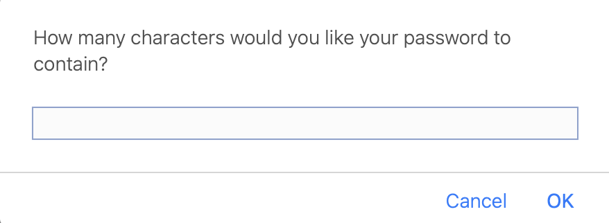
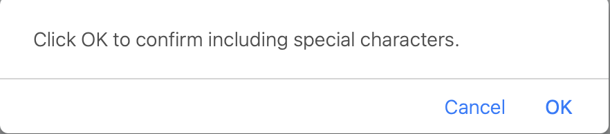
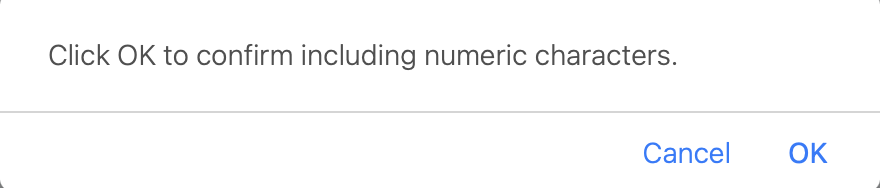
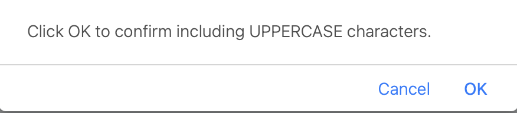
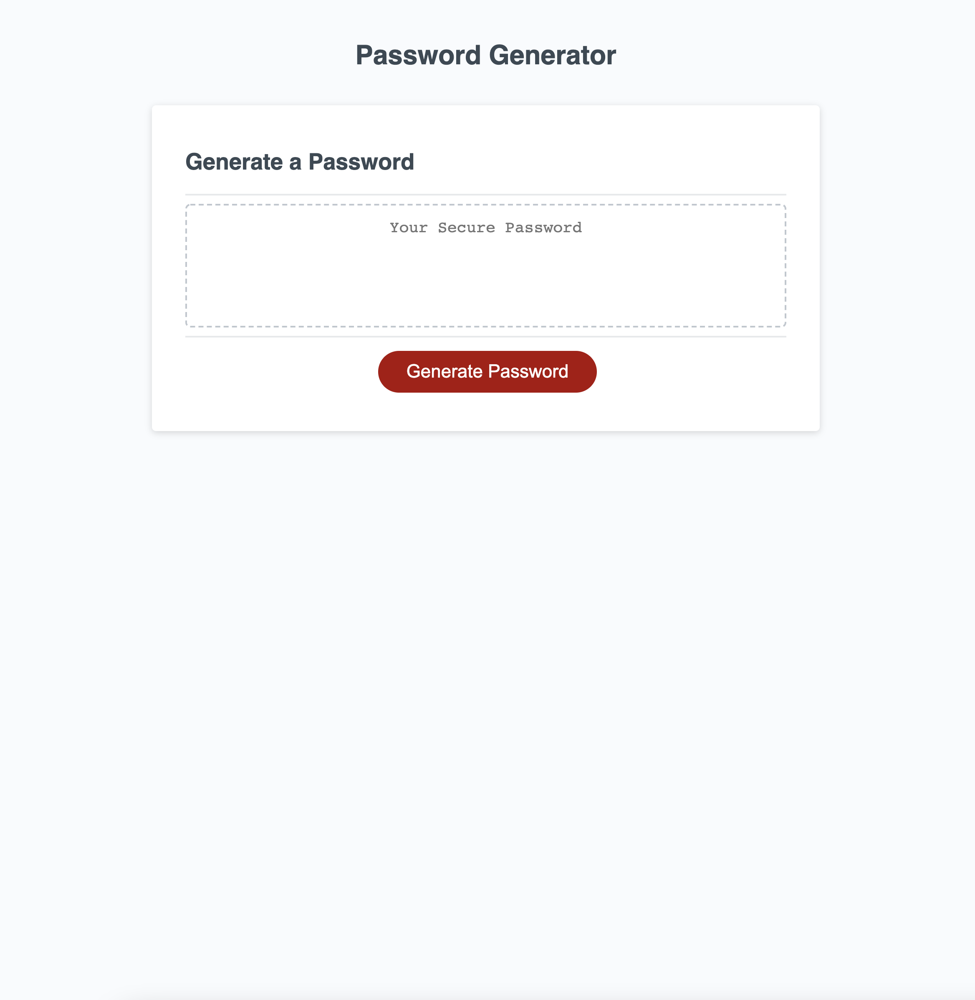

# Password Generator

## How-to-use:

1. Click "Generate Password" button.

 

2. Enter amount of characters desired.

 

3. Click OK if you would like special characters in password.

 

4. Click OK if you would like numeric characters in password.

 

5. Click OK if you would like UPPERCASE characters in password.

 

### Result:

A unique and random password!

# Website Picture

## Links:

https://github.com/KarenHarley/03-Homework

https://karenharley.github.io/03-Homework/
